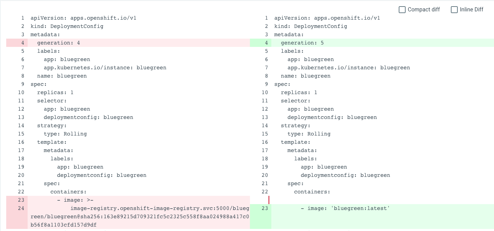

| Category | Niveau | Preparation time | Demo time
|--|--|--| --| 
| Demo | :red_circle::white_circle::white_circle::white_circle: | 5 min| 15 min| 

# Deep dive Documentation

It is possible for an application to be OutOfSync even immediately after a successful Sync operation. How to fix the issue ?

First, please look at the Argo CD [documentation](https://argoproj.github.io/argo-cd/user-guide/diffing/)
When we get Kubernetes CRD, we can see some differences between the manifest we sent and the content we receive after getting the CRD. This things are normal. Kubernetes add or complete CRD with usefull information.

Example : When we deploy the bluegreen DeploymentConfig, at the right we have our initial CRD and the left the content we get from the cluster.

