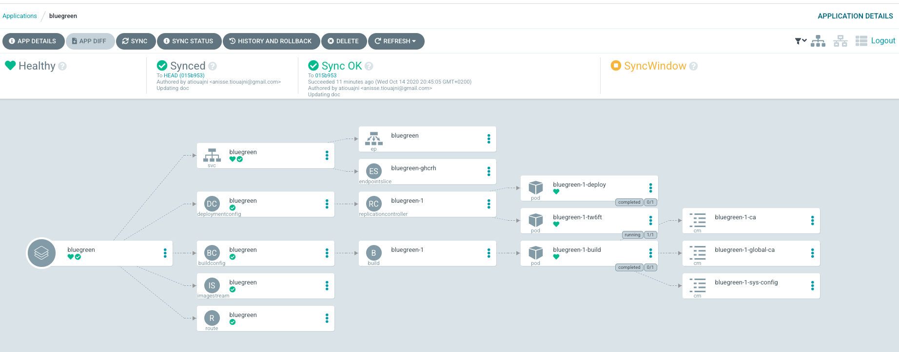
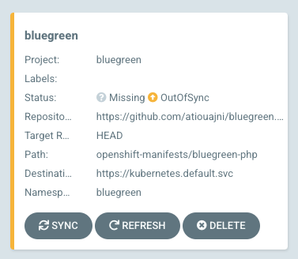
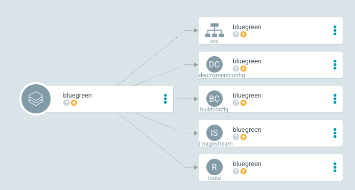
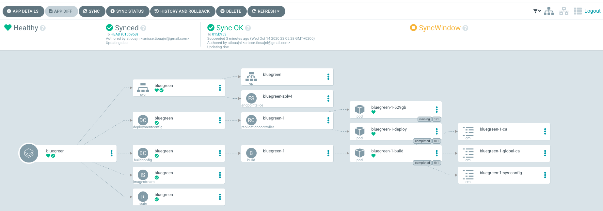

# Introduction
This repository will provide ArgoCD features to our basic [bluegreen application](https://github.com/atiouajni/bluegreen).

After completing this tutorial you will be able to accomplish the following tasks:

- Configure Argo CD to watch GIT repositories
- Automatically apply approved changes to your system (Continuous Delivery)

[](./docs/img/argocd-homepage.png) 

# Requirements
 - Openshift 4.5+ (Installed and configured)
 - oc cli 

# Setup

## Install Argo CD Operator

**1 - Create a new project**
```shell
oc new-project argocd
````

**2 - Subscribe to the Argo CD Community operator**
```shell
oc apply -f openshift-manifets/argocd-operator-subscription.yaml
```
**3 - check the operator status **
```shell
oc describe sub argocd-operator

# In the command output, find the Conditions section:
Conditions:
    Last Transition Time:   2020-10-14T14:55:55Z
    Message:                all available catalogsources are healthy
    Reason:                 AllCatalogSourcesHealthy
    Status:                 False
    Type:                   CatalogSourcesUnhealthy

```

>You can find how to install Argo CD Operator manually from [the documentation](https://argocd-operator.readthedocs.io/en/latest/install/openshift/)

# Installation
## I - Installing bluegreen application

Follow [bluegreen application](https://github.com/atiouajni/bluegreen#installation) installation process.

## II - Installing Argo CD Server

**1 - Instantiating a new Argo CD server instance**
```shell
oc project argocd
oc apply -f openshift-manifests/argocd-instance.yaml
```

**2 - Check the status**
```shell
oc describe ArgoCD/argocd-instance

# In the command output, find the Status section:
Status:
  Application Controller:  Running
  Dex:                     Running
  Phase:                   Available
  Redis:                   Running
  Repo:                    Running
  Server:                  Running

```

**3 - Retrieve default admin password**
```shell
oc get secret argocd-instance-cluster -o jsonpath='{.data.admin\.password}' | base64 -d
```

**4 - Access the Argo CD web interface**
```shell
#Retieve the route location and check the url from your browser
export ARGOCD_URL=$(oc get route argocd-instance-server -o jsonpath='{.spec.host}')
chrome https://$ARGOCD_URL
```

>Now you can access to Argo CD app with the user "admin"


# Usage
Once installation is done and you are able to access to Argo CD web interface, you can deploy an Application CRD. For this step, we will use the bluegreen repository as a source.
```shell
oc apply -f openshift-manifests/argocd-application.yaml
```
From your browser, you should see a new Application to sync.

 


# Cleanup
```shell
oc delete project argocd
````

# Released versions
Section inprogress..
